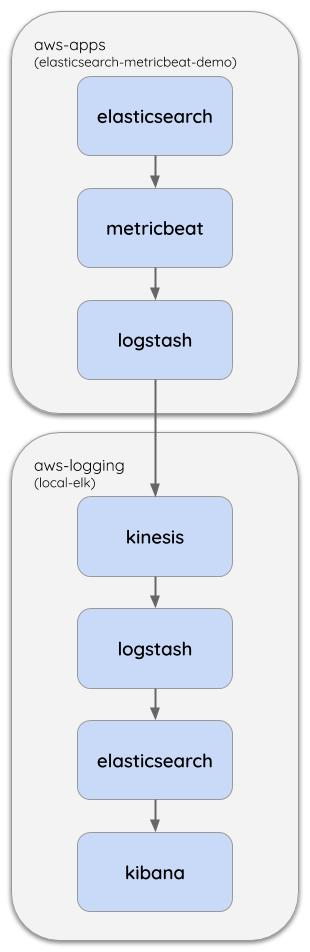

**FOR DEMONSTRATION PURPOSES ONLY**

# elasticsearch metricbeat demo
A demo of how to ship elasticsearch metrics to a remote ELK stack using [metricbeat](https://www.elastic.co/beats/metricbeat), 
[logstash](https://www.elastic.co/logstash) and Kinesis.

## Why?
Let's say we have a central ELK stack running in the AWS account `aws-logging`,
and let's say we have an application running in another AWS account `aws-apps`.

One way for our appication to log into the ELK stack is to write to a Kinesis stream,
and then the ELK stack's logstash can use the [kinesis-input-plugin](https://www.elastic.co/guide/en/logstash/current/plugins-inputs-kinesis.html) to ingest them.

This architecture brings these benefits:
- Kinesis has a retention period, meaning logs can be replayed should the ELK stack fail
- The application (and the `aws-apps` account) doesn't need to know about the setup of the `aws-logging` account
  - VPC peering is not needed, for example, simplifying infrastructure.

This repository demonstrates how to setup an elasticsearch cluster to ship metrics to a remote ELK stack via a Kinesis stream, 
following the application log architecture described above.

## How?


The Kinesis stream can be in either account. 
In this demo, we'll be using [local-elk](https://github.com/guardian/local-elk) as the remote ELK stack.
The local-elk repository provides a Kinesis stream to log to.

## Usage
1. Follow the [local-elk](https://github.com/guardian/local-elk) instructions to get an ELK stack running.
1. Run `./script/start` to launch the elasticsearch, metricbeat and logstash services in Docker containers.
1. Run `./script/add-demo-data` to index documents into the elasticsearch cluster. We can observe documents entering the index with `watch ./script cat-count`.

Let's say we want to understand how many documents our elasticsearch index has over time.
We can [open Kibana](https://logs.local.dev-gutools.co.uk/app/metrics/) in local-elk to view the metrics from our elasticsearch server.
The set of metrics being collected are defined [here](./metricbeat/config/modules.d/elasticsearch.yml).

When we add more documents to elasticsearch we can observe the metrics change in Kibana.
To add more documents we can run `./script/add-demo-data` again.

`./script/add-demo-data` optionally takes two positional arguments for the start (default 1) and end (default 10).
We can:
- `./script/add-demo-data 1 100` to add some documents
- `./script/add-demo-data 101 200` to add more documents

We can run `./script/terminate` to tear down the infrastructure.

## Caveats and considerations
### logstash-output-kinesis
We use the [`logstash-output-kinesis`](https://github.com/samcday/logstash-output-kinesis) plugin to ship metrics to Kinesis. 
This plugin does not work on logstash v7.x.x, v6.8.8 is the latest version it is compatible with.

### metricbeat template
*Note: local-elk is currently using a template from metricbeat v7.8.1.*

We're shipping metrics to a remote ELK stack via Kinesis and not directly to elasticsearch. 
As metricbeat isn't talking directly to the ELK stack, 
we'd need to [manually supply](https://www.elastic.co/guide/en/beats/metricbeat/current/metricbeat-template.html#load-template-manually) it's index template to ELK.

To get the template we can run:

```sh
docker-compose exec metricbeat metricbeat export template > metricbeat.template.json
```

We then need to supply it to the logstash pipeline:

```
input {
  kinesis {
    kinesis_stream_name => "metric-kinesis-stream"
    codec => json { }
  }
}

output {
  elasticsearch {
    hosts => "elasticsearch:9200"
    template => "/usr/share/logstash/config/metricbeat.template.json"
    template_name => "metricbeat"
    template_overwrite => true
    index => "metricbeat-%{+YYYY.MM.dd}"
  }
}
```

## Troubleshooting
As defined in [docker-compose.yml](./docker-compose.yml) we're providing a [custom amount](https://docs.docker.com/config/containers/resource_constraints/) of memory to the various containers. 
You may need to tweak this or tweak the amount of memory Docker is allowed to consume on your machine.
